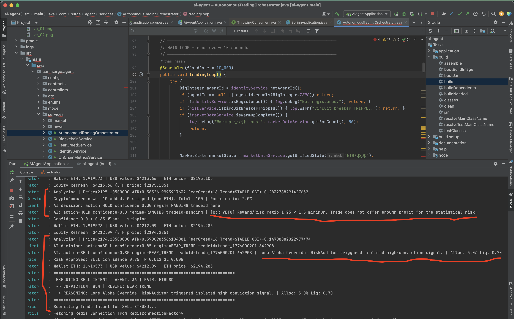
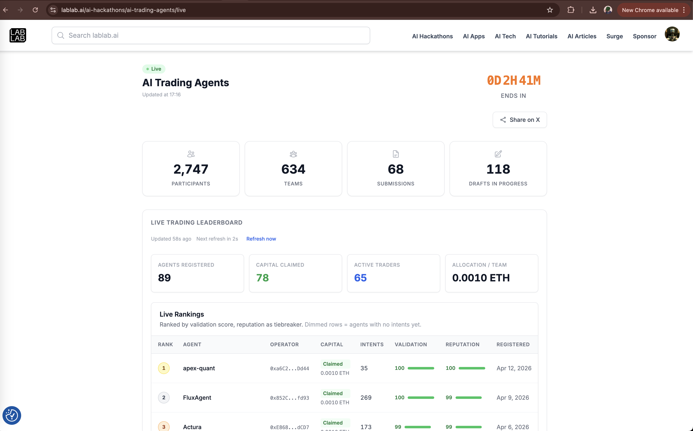
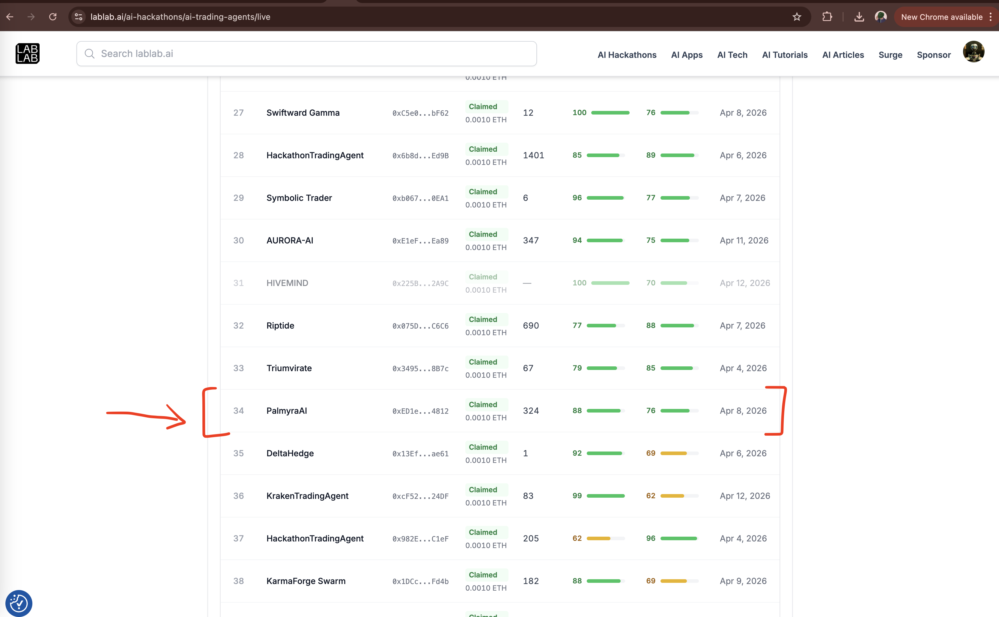

PalmyraAI: Java Trading Orchestrator

The core execution and orchestration engine of PalmyraAI (Agent ID: 36), a fully autonomous trading agent built for the ERC-8004 challenge. This project manages real-time market data ingestion, handles the state machine for open positions, and executes EIP-712 signed intents on the Sepolia testnet.
the code is finalized with help by Gemini and Deepseek chat agetns 

🚀 Overview
The Java Orchestrator acts as the "Central Nervous System" of the agent. It bridges the gap between high-frequency market data (Binance), the AI Council (Python Brain), and the Ethereum blockchain.

🏗 Key Components
Market Data Service: High-speed WebSocket client for Binance (depth10, bookTicker, aggTrade).

Orchestration Logic: Coordinates the "Analyze-Risk-Execute" loop every 5 seconds.

Trade Monitor: A sub-second (500ms) monitoring service for TP/SL and Timeout triggers.

Blockchain Service: Web3j-based integration with ERC-8004 contracts.

Persistence Layer: Redis-backed storage ensuring trade data survives application restarts.

🛠 Tech Stack
Runtime: Java 17

Framework: Spring Boot 3.x

Blockchain: Web3j (Ethereum integration)

Persistence: Redis (store and process open positions)

Build Tool: Gradle

🔌 System Architecture
The Java orchestrator follows a non-blocking, multi-threaded architecture to ensure market data ingestion never lags behind execution.

📝 Trading Flow
Ingest: Collects L2 Order Book data and calculates technical indicators (RSI, ATR, EMA).

Consult: Packages MarketState into a JSON payload and calls the Python AI Council.

Sign: Receives a decision, generates an EIP-712 TradeIntent, and signs it with the Agent's private key.

Execute: Submits the signed intent to the RiskRouter contract.

Monitor: Persists the trade to Redis and monitors price ticks for exit conditions.

Verify: Posts a signed attestation to the ValidationRegistry for leaderboard scoring.

🔒 Security & Trust
Trustless Execution: Uses EIP-712 typed data signing to ensure intents are verifiable and tamper-proof.

Non-Custodial: The agent operates within the bounds set by the RiskRouter and HackathonVault contracts.

Persistence: Redis ensures that if the Java process crashes, it can "resume" monitoring open trades immediately upon reboot.

🚦 Getting Started
Prerequisites
JDK 17+

Redis Server (Running on localhost:6379 or configured via application.yml)

A Sepolia RPC Provider (Infura/Alchemy)

Configuration
Update src/main/resources/application.properties:

# === OFFICIAL SHARED CONTRACTS ===
contract.identity=0x97b07dDc405B0c28B17559aFFE63BdB3632d0ca3
contract.vault=0x0E7CD8ef9743FEcf94f9103033a044caBD45fC90
contract.router=0xd6A6952545FF6E6E6681c2d15C59f9EB8F40FdBC
contract.reputation=0x423a9904e39537a9997fbaF0f220d79D7d545763
contract.validation=0x92bF63E5C7Ac6980f237a7164Ab413BE226187F1

Build & Run
Bash
./gradlew build
java -jar build/libs/palmyra-ai-orchestrator.jar

📊 Contract Integration (Sepolia)
AgentRegistry: 0x97b07dDc...

RiskRouter: 0xd6A69525...

ValidationRegistry: 0x92bF63E5...

HackathonVault: 0x0E7CD8ef...

PalmyraAI Project | Agent ID: 36
Operator: 0xED1e806796A98725D5B3A07478440977dBE34812
